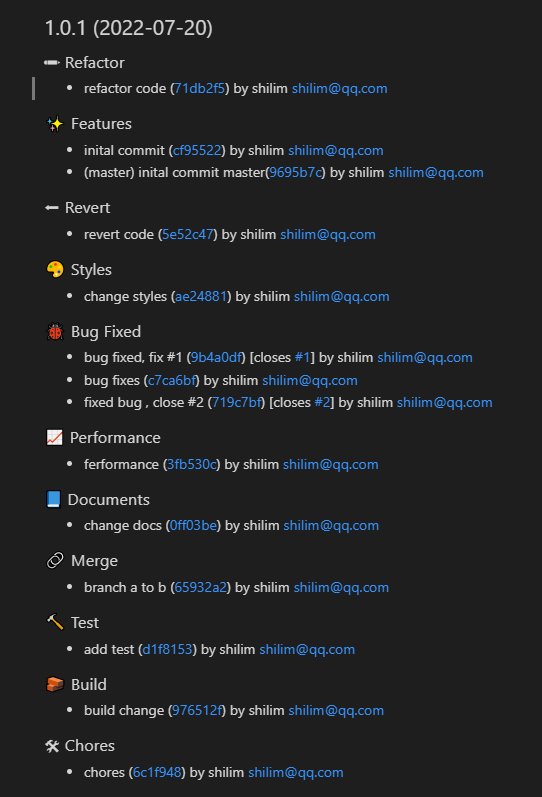

#  [![NPM version][npm-image]][npm-url]

> This preset extends the [conventional-changelog-eslint](https://github.com/conventional-changelog/conventional-changelog/tree/master/packages/conventional-changelog-eslint) preset


# Installation
Using npm:

```
$ npm i -g conventional-changelog-normal
```

# Usage

```
conventional-changelog -p normal -i CHANGELOG.md -s -r 0
```

# Preview


# Support
| tag      | Description                                                                                            |
| -------- | ------------------------------------------------------------------------------------------------------ |
| feat     | feature                                                                                                |
| fix      | bug fix                                                                                                |
| docs/doc | documentation change                                                                                   |
| style    | changes that do not affect the meaning of the code (white-space, formatting, missing semi-colons, etc) |
| refactor | change that neither fixes a bug nor adds a feature                                                     |
| test     | adding missing tests or correcting existing tests                                                      |
| chore    | other changes that don't modify src or test files                                                      |
| merge    | merge branch                                                                                           |
| perf     | change that improves performance                                                                       |
| revert   | reverts a previous commit                                                                              |
| build    | changes that affect the build system or external dependencies (example scopes: gulp, broccoli, npm)    |

[npm-image]: https://badge.fury.io/js/conventional-changelog-normal.svg
[npm-url]: https://www.npmjs.com/package/conventional-changelog-normal

